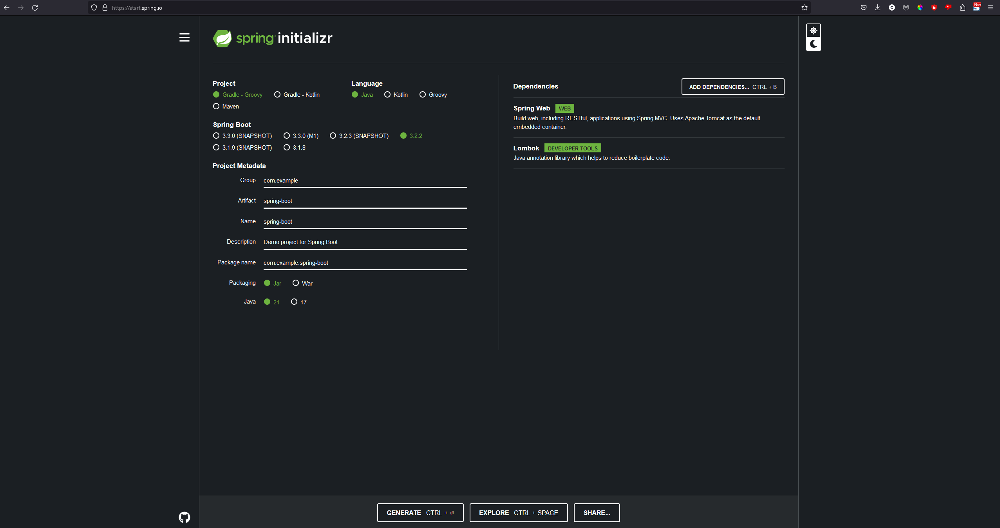

# Spring Boot Starter Guide (Created with Spring Initializer)

These were my settings to create this project, you don't need to do this:

https://start.spring.io/

## Local Environment Prerequisites
Make sure you have java installed for your OS:
1. [Java 21](https://www.oracle.com/java/technologies/downloads/)

## Running The App
If you are running on VSCode, open the terminal and ensure you are in the root folder (same folder level as gradlew.bat)

If you are mac/linux run with:
`./gradlew bootrun`

If you are on windows run with:
`gradlew.bat bootRun`

Head over to [localhost](http://localhost:8080/)

And you should see the following message based on the content from the HelloController get request (src/main/java/com/example/springboot/HelloController.java):

```Greetings from Spring Boot!```